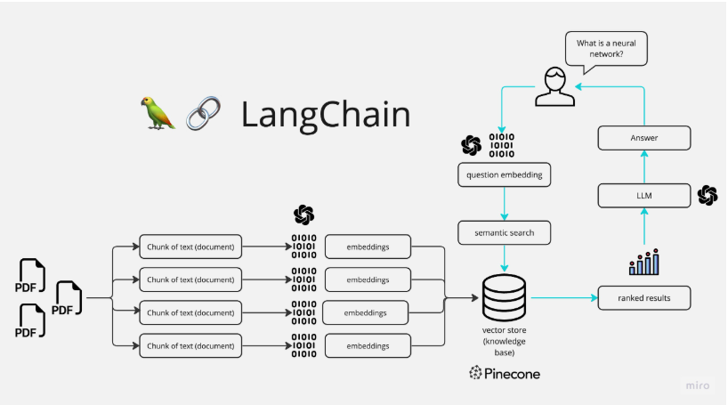

# MultiPDF-ChatAgent
A Streamlit web app that lets users upload multiple PDFs, extract their content, and chat in real time with a bot trained on that information.

## Description

The Multi-PDF's Chat Agent is built using Streamlit and LangChain libraries. It provides a user-friendly interface for users to upload PDF documents, extract textual information from them, train a chatbot on the extracted content, and then have conversations with the chatbot.

## Features

- Upload multiple PDF documents for text extraction.
- Train a chatbot on the extracted textual content.
- Have interactive conversations with the chatbot.
- Easily manage the training process and interactions.

## Installation

1. Clone the repository to your local machine.
2. Install the required packages using `pip`.
3. Create a `.env` file in the project directory and add your OpenAI API key >  OPEN_AI_APIKEY=your-openai-api-key

## Usage

1. Run the Streamlit application: streamlit run app.py
2. Use the sidebar to upload PDF files and train the chatbot.
3. Once trained, you can have conversations with the chatbot by entering questions in the text input field.
